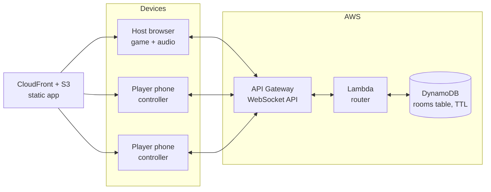

# Track Record Multiplayer — Architecture Design Doc

Status: DRAFT for review · Author: James Londrigan · July 2026

> **Amendment 2026-07-17 (removed after playtest):** Hybrid rooms are removed. A
> multiplayer room's players come only from phone joins; the host device never
> contributes local players and the single-device handoff gate does not appear
> inside a room. A player without a phone shares another player's phone or the
> group plays single-device mode. Sections 2 and 7 updated accordingly.

## 1. Goal and non-goals

**Goal:** Evolve Track Record from pass-the-phone to a Jackbox-style model: one device is the **host** (runs the game, plays audio, shows reveals and the chart), and each player joins from their own phone with a room code to submit guesses simultaneously and secretly.

**Why:** Kills the biggest pacing drag at 6+ players (serial phone-passing during year guesses), makes guesses truly simultaneous (more dramatic reveals), and serves as a production serverless real-time reference architecture for my Solutions Architect portfolio.

**Non-goals (v1):**
- No accounts, no persistence beyond a live room, no matchmaking, no public rooms.
- No server-side audio. Clips play only on the host device (one set of speakers is the party model).
- No spectators, no reconnect-into-a-different-game, no chat.
- Single-device mode remains fully supported and unchanged; multiplayer is additive.

## 2. Player experience flows

**Host:** Setup screen gains "Play with phones" toggle → app creates a room → host screen shows a 4-letter room code + join URL + QR. Lobby lists players as they join. Host starts the game; gameplay is identical to today except the year-guess phase says "Waiting for guesses… 3/5 in" instead of pass-the-phone.

**Player:** Visits jameslondrigan.com/trackrecord/join (or scans QR) → enters code + name → sees a minimal controller: waiting states, then the tuner dial when a year guess opens, then "locked in" confirmation. The controller is deliberately thin: the game lives on the host screen; the phone is an input device.

**Phoneless players:** There is no hybrid collection. A player without a phone shares another player's phone, or the group plays single-device (pass-the-phone) mode instead. The single-device handoff gate never appears inside a room.

## 3. Architecture overview

The static site (existing S3 + CloudFront) serves both the host app and the controller. All real-time traffic flows through one API Gateway WebSocket API backed by a single router Lambda and one DynamoDB table. There are no servers to run, and the entire real-time stack costs ~$0 when nobody is playing.

## 4. Decision records

### ADR-1: WebSockets over polling or SSE
A year-guess round needs low-latency bidirectional messaging: players push guesses up, the host pushes phase changes down, the lobby updates live. Short-polling wastes requests and feels laggy at a party; SSE is server→client only, so guess submission would need a parallel HTTP path. WebSockets give one duplex channel and map cleanly to the "room" mental model. **Chosen: WebSockets.**

### ADR-2: API Gateway WebSocket API + Lambda over a container socket server
Alternatives considered:
- **Fargate/ECS socket server (socket.io):** most flexible, but it's an always-on container: ~$15+/mo idle, patching, scaling policy, health checks. For a game played a few evenings a month, paying for 720 hours to use 6 is the wrong shape.
- **AppSync Events / IoT Core:** managed pub/sub works, but obscures the interesting engineering (connection routing, state) behind a product; weaker portfolio story; AppSync pricing and modeling overhead for a tiny message vocabulary.
- **Third-party realtime (Ably, PartyKit, Firebase RTDB):** fastest to ship, but outsources exactly the part I want to demonstrate, adds a vendor, and free tiers change under you.
- **API Gateway WebSocket + Lambda:** scales to zero, pay-per-message, native IAM/Terraform/CloudWatch integration, and forces explicit design of connection lifecycle and state, which is the educational and demonstrable core. Cold starts (~100-300ms on a warm-ish Node Lambda) are acceptable for a party game where sub-second is fine and sub-100ms is unnecessary. **Chosen: API GW WebSocket + Lambda.**

### ADR-3: DynamoDB single-table with TTL over RDS/ElastiCache
Room state is small (a few KB), access is strictly key-based (everything keyed by room code), lifetime is hours, and concurrency is light. That is the textbook DynamoDB shape. On-demand billing rounds to zero at this scale. TTL gives free garbage collection: rooms self-delete ~24h after last activity, so there is no cleanup job and no orphaned state. RDS is structurally wrong (connections, cost floor); ElastiCache is another always-on cost floor. **Chosen: DynamoDB on-demand, single table, TTL.**

### ADR-4: Host-authoritative game logic, thin server
Two options for where game rules live:
- **Server-authoritative:** Lambda validates every transition, owns scoring. Correct for adversarial games; doubles the logic surface and porting cost (the game engine already exists client-side).
- **Host-authoritative:** the host device runs the existing game engine unchanged; the server is a message router + room registry that enforces only structural rules (room exists, name unique, one guess per player per round, guesses hidden until reveal).
Threat model: family and friends in one room; the "attacker" is your cousin, and the social layer already polices cheating. Server-side validation of *game rules* buys nothing here. **Chosen: host-authoritative.** The server still keeps guesses server-side until the host opens the reveal, so a curious player can't peek at others' guesses via devtools — cheap integrity where it matters, no engine duplication where it doesn't.

### ADR-5: Reconnection by player token, not connection identity
API Gateway assigns a new connectionId on every connect; phones on party wifi WILL drop. Identity therefore cannot be the connection. On join, the server issues a random playerToken the controller stores in sessionStorage; reconnect presents roomCode + token and the server re-points that player to the new connectionId. Host gets the same treatment with a hostToken, plus a grace window: rooms survive host disconnects (state is in DynamoDB, not in the socket), and the host page can reclaim the room within the TTL. Refresh-proof by design.

## 5. DynamoDB data model (single table `tr-rooms`)

| PK | SK | Attributes |
|---|---|---|
| ROOM#{code} | META | hostToken, hostConnectionId, phase, roundNo, gmIndex, settings, createdAt, ttl |
| ROOM#{code} | PLAYER#{token} | name, connectionId, score, joinedAt, connected |
| ROOM#{code} | GUESS#{roundNo}#{token} | year, submittedAt |

- Room code: 4 chars from an unambiguous alphabet (no O/0/I/1), ~390K combinations; collision-checked on create; rate-limited joins make brute-force enumeration impractical for a toy target.
- One query (`PK = ROOM#{code}`) loads a whole room. All writes are single-item; the only conditional write is guess submission (reject if phase != guessing or guess exists).
- `ttl` refreshed on activity; expiry = auto-cleanup.

## 6. Message protocol (JSON over the socket)

Client→server actions: `createRoom`, `joinRoom {code, name}`, `rejoin {code, token}`, `submitGuess {year}`, `host:phase {phase, payload}`, `host:kick {token}`, `heartbeat`, and (Phase B, GM-from-phone) `gm:year {year}` / `gm:pick {indices}` (from the GM's phone) and `host:gm {token, stage, payload}` (host sets the round's GM and relays a stage).
Server→client events: `roomCreated {code, hostToken}`, `joined {token, roster}`, `rosterUpdate`, `phaseChange {phase, payload}` (openGuess carries the year bounds so the controller renders the dial), `guessProgress {submitted, total, in: [names], waiting: [names]}` (per-name status now that every player joins by phone; guess VALUES stay server-side until reveal), `revealGuesses {guesses[]}`, `error {code, msg}`, and (Phase B) `gmStage {stage, payload}` (to the GM's phone only; stages: `year` with bounds + eligibleYears, `pick` with candidate title/artist pairs, `done`), `gmYear {year}` / `gmPick {indices}` (relayed to the host only), `gmRejoined {token}` (host re-sends the current stage).
Payload cap ~4KB enforced in the router; unknown actions rejected; every action except createRoom/joinRoom must present a valid token for the room bound to that connection. `gm:*` actions additionally require the sender to hold the room's current GM token (`gmToken` on META, set by `host:gm`: a single attribute, no schema change). The server validates only structure and token ownership; game validity (year snapping, candidate math) stays host-authoritative (ADR-4).

> **Amendment 2026-07-18 (Phase B):** added the `gm:year` / `gm:pick` / `host:gm` actions and the `gmStage` / `gmYear` / `gmPick` / `gmRejoined` events for GM-from-phone, and extended `guessProgress` with per-name `in`/`waiting` arrays. No table schema change (`gmToken` is one META attribute).

## 7. Failure modes and answers

- **Player drops mid-guess:** reconnect via token; if the round closed meanwhile, controller shows "round closed" and rejoins flow at the current phase. The host does not collect a dropped player's guess on its own device (the hybrid path is removed); reconnect is the recovery.
- **Host drops:** room persists in DynamoDB; host page auto-reclaims with hostToken on reload; players see "host reconnecting". If the host never returns, TTL clears the room.
- **Guess deadline:** host controls pacing (it can close the round with N-of-M in, matching how the table actually plays); no server timers needed.
- **Two devices claim host:** hostToken wins; a second claim with the right token displaces the old connectionId (this is the recovery path, not a bug).
- **Region outage:** the game degrades to exactly today's pass-the-phone mode, which remains fully client-side. Multiplayer is an enhancement layer with a built-in fallback — this is the availability story.

## 8. Security posture

No auth by design (party game, no PII beyond first names, no persistence). Controls that DO matter: room-code entropy + join rate limiting (API GW throttling + a per-IP joinAttempt guard), token-bound actions, payload caps, guesses hidden until reveal, TTL data expiry, CloudWatch alarms on Lambda error rate. WAF is overkill for wss at this scale; noted as a future option.

## 9. Cost model (the punchline)

API GW WebSocket: $0.25/million messages + $0.25/million connection-minutes. A big game night (8 players × 2 hours, chatty protocol ≈ 2K messages) is roughly **$0.001**. Lambda and DynamoDB on-demand at this volume sit inside the free tier essentially forever. Fixed costs: $0. The architecture's idle cost is the Route 53 hosted zone I already pay for. Compare: the Fargate alternative is ~$180/yr to host the same six evenings.

## 10. Infrastructure and delivery

New Terraform module `multiplayer/` alongside the existing site modules: API GW WebSocket API + stage, router Lambda (Node 20), DynamoDB table with TTL, IAM (least-privilege: Lambda can only ManageConnections on this API and R/W this table), CloudWatch log groups + error alarm. Custom domain `wss://ws.jameslondrigan.com` via API GW custom domain + ACM + Route 53 (same pattern as the site cert). Deployed by the existing GitHub Actions OIDC pipeline with a separate workflow path filter so game-frontend deploys don't churn infra.

## 11. Build phasing

- **Phase A (MVP): guess collection only.** Host toggle, room create/join/lobby, controllers submit year guesses, host reveals. Everything else (name-that-tune scoring, GM song picking) stays on the host device exactly as today. This proves the entire architecture with the smallest protocol.
- **Phase B: richer controllers.** GM picks year + songs from their own phone; award taps from the host; possibly typed title/artist answers with host adjudication.
- **Phase C: polish.** QR on host screen, per-player colors on the chart, reconnect UX niceties.
Phase A is the September demo target. B and C follow playtests.

## 12. Open questions for review
1. Guess visibility on reveal: show all guesses at once on the host chart (dramatic) vs one-by-one (slower, more drama per player)? Leaning all-at-once with a stagger animation.
2. Should the controller show the song recap (title · artist) during guessing, mirroring the single-device tuner screen? Leaning yes — same memory-aid logic.
3. Room code words instead of letters (e.g. MAROON-42)? Cuter, longer to type. Leaning no for v1.
4. Do we need a heartbeat/presence indicator in the lobby, or is rosterUpdate-on-disconnect enough for v1?
