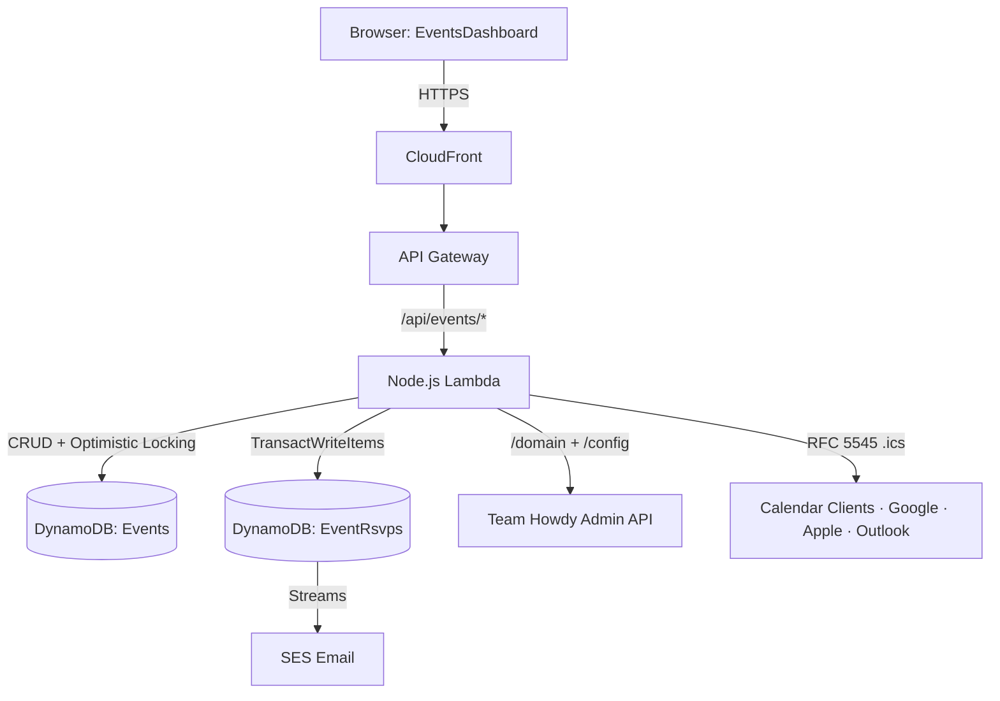

## The platform

The CMIS Engagement Platform is a multi-team monorepo built by four student teams at Texas A&M for ISTM 665 in Spring 2026. The platform serves students, admins, judges, and external partners across four product surfaces — student profiles, partner company management, external auth and graduation handover, and case competitions and events. Each team owned a service layer; mine, Team 12th Man, owned the **Event & Competition Core**.

This case study is about the Event Service specifically, and within it the three pieces I owned end-to-end.

## What I built

### 1. The Velvet Rope

The Event Service's most distinctive mechanic is tier-gated early RSVP access for partner companies. We called it the Velvet Rope. The math is simple:

```
UnlockTime = EventStartTime - EarlyAccessHours[user.tier]
```

A Gold partner with 48 hours of early access can RSVP starting two days before the event opens to the public; a Silver partner with 24 hours, one day before. When a user attempts to RSVP, the service:

1. Resolves the user's email domain to a `tierId` by calling **Team Howdy's Admin API** (`GET /domain/{domain}`).
2. Fetches the global `earlyAccessHours` for that tier from Howdy's `/config` endpoint.
3. Checks for event-level tier overrides — admins can set per-event policies (e.g., "Silver gets 12 hours for this specific event") that take precedence over global defaults.
4. Determines whether the current time is past the user's unlock time. If not, it returns the unlock time so the UI can render a live countdown.

The most consequential decision in this whole subsystem was the **fail-closed posture**. If Howdy's API is unresponsive, the Event Service returns a **503 Service Unavailable** rather than degrading to "let everyone in." Degraded-open mode would have been easier to ship and would have looked the same most of the time, but it would have silently undermined the entire reason the tier system exists: a partner who paid for early access can't trust the gate if the gate quietly opens whenever it can't see them. Better to fail loud than to honor partner agreements only sometimes.

Exemptions are hardcoded for users in the `students` or `alumni` Cognito groups, the event creator, and platform admins — these bypass the Velvet Rope entirely.

The same math engine (`velvetRope.ts`) also runs client-side in the Svelte EventsDashboard for live countdown rendering — *"Opens for Silver Partners in 2 days"* — so the UI mirrors the server's authoritative decision without a second round trip. The server remains the source of truth; the client just displays it.

### 2. The initial Terraform

When we started, the Event Service didn't exist as AWS infrastructure. No Lambda, no DynamoDB tables, no API Gateway routes, no IAM policies, no state. Someone had to write the first Terraform that turned the architecture diagram into actual cloud resources. That was me.

The pieces I stood up:

- **Lambda function** for the Node.js service, with runtime, handler, environment variables, and a scoped execution role
- **API Gateway HTTP API** with `/api/events/*` routes proxied through to the Lambda
- **DynamoDB tables** — Events (with the `version` attribute that the optimistic-locking pattern relies on) and EventRsvps (with the `userId-index` GSI for fast per-user lookups, and Streams enabled to feed the SES email pipeline)
- **IAM** policy that granted the Lambda only the specific DynamoDB and SES actions it actually needed — no wildcards
- **Cross-service plumbing** — env vars and the shared Cognito User Pool reference so the Event Service trusts JWTs issued by the platform-wide auth setup

The thing about going first on infra is that every decision propagates. Resource naming conventions, variable hierarchy, state backend layout — once teammates start adding their own resources on top of yours, those decisions get inherited. So "initial Terraform" wasn't really about writing the most code; it was about getting the foundation right enough that nobody had to rewrite it later. The other Team 12th Man features (atomic RSVPs, waitlists) and the calendar integration I added afterward all built directly on the table schemas, IAM scopes, and naming patterns I set down in this pass.

### 3. Calendar integration

Once a user RSVPs, they want the event on their actual calendar. The Event Service exposes two endpoints that generate **RFC 5545-compliant ICS files** which work natively with Google Calendar, Apple Calendar, and Outlook:

- `GET /api/events/:eventId/calendar` — **public**, single event. Anyone with the link can subscribe.
- `GET /api/users/me/calendar` — **authenticated**, returns the user's full CONFIRMED schedule.

Two design decisions worth calling out:

**CONFIRMED-only filter on the bulk export.** WAITLISTED RSVPs are excluded from the user-schedule endpoint. WAITLISTED is an uncertain state — the user might be promoted, might not — and putting "maybe-attending" events on someone's actual calendar creates fake commitments. Once a waitlist promotion fires (via the DynamoDB Stream → SES pipeline), the event automatically becomes eligible for the next calendar sync. This is the kind of product detail that's invisible when it works and frustrating when it doesn't.

**Fail-open on malformed dates.** If an event has a malformed date field, the generator skips that single event and logs a warning rather than failing the whole response. This is a deliberate inversion of the Velvet Rope's fail-closed posture — and the reason they're opposite is the most useful idea I took from building both. The Velvet Rope fails *closed* because letting an unauthorized user through silently undermines partner agreements (correctness matters more than availability). The calendar export fails *open* because dropping a single event from a user's calendar is a much milder failure than refusing to give them any calendar at all (availability matters more than completeness). The "right" failure mode depends entirely on what kind of wrong you're willing to be — and that question is one I'd never thought to ask before this project.

ICS format reference and sample output: [REFERENCE.md — Calendar/ICS reference](https://github.com/cmis-prod/CMIS/blob/develop/services/event-service/REFERENCE.md#6-calendarics-reference).

## How the rest of the Event Service fits

Teammates owned two more mechanics that compose with mine:

**Atomic RSVPs** — `TransactWriteItems` wraps the "increment `currentRsvps` conditional on `currentRsvps < capacity`" and "insert RSVP record" operations into a single atomic transaction, so two simultaneous RSVPs racing past the last slot can't both succeed. Combined with the optimistic locking my Terraform set up on the Events table, this is what keeps the platform consistent under concurrent load.

**Smart waitlists** — when an event hits capacity, RSVPs fall through to a waitlist sorted by tier rank then timestamp (so the same tier semantics as the Velvet Rope hold on the waitlist too). When a confirmed user cancels, the highest-priority waitlisted user is atomically promoted to CONFIRMED in a single `TransactWriteItems` call. DynamoDB Streams on the EventRsvps table fire the SES confirmation emails when the status transitions.

## Architecture



## What I'd do differently

The thing I'd change about the initial Terraform is that I wrote it as flat `.tf` files for speed — get the resources up, unblock the team. That worked early, but as teammates layered on atomic-RSVP logic, waitlist tables, and the calendar endpoints, the files got unwieldy and changes started touching too many things. I'd refactor into Terraform modules — one per logical concern (data layer, API surface, IAM, integrations) — *before* the team started building on top, not after. The cost of restructuring infrastructure code goes up with every dependency someone else writes against it.

## What I learned

Writing the initial Terraform taught me that the technical decisions you make first are the ones your team inherits — table schemas, naming conventions, IAM scopes, fail modes — and they're disproportionately expensive to change later. The work that looks the most boring early in a project is often the work that determines what's possible later. That mental model has stuck with me well beyond this course; it shapes how I'd start any new system now.

## Stack

AWS Lambda (Node.js) on API Gateway HTTP API. DynamoDB for persistence, with `TransactWriteItems` for atomic RSVP and capacity ops, a `version` attribute for optimistic locking, a GSI on EventRsvps for per-user lookups, and Streams to trigger downstream SES emails. Cognito for JWT auth and group-based exemption checks. SES for transactional email. CloudFront + S3 for the Svelte frontend. Terraform across the board for infra.

## Team & repo

ISTM 665 — CMIS Engagement Platform, Spring 2026. Built across four student teams (Howdy, Gig 'Em, Reveille, 12th Man). The team monorepo is [cmis-prod/CMIS](https://github.com/cmis-prod/CMIS); my standalone Event Core extract is at [jameslondrigan/twelfth-man-event-core](https://github.com/jameslondrigan/twelfth-man-event-core).
